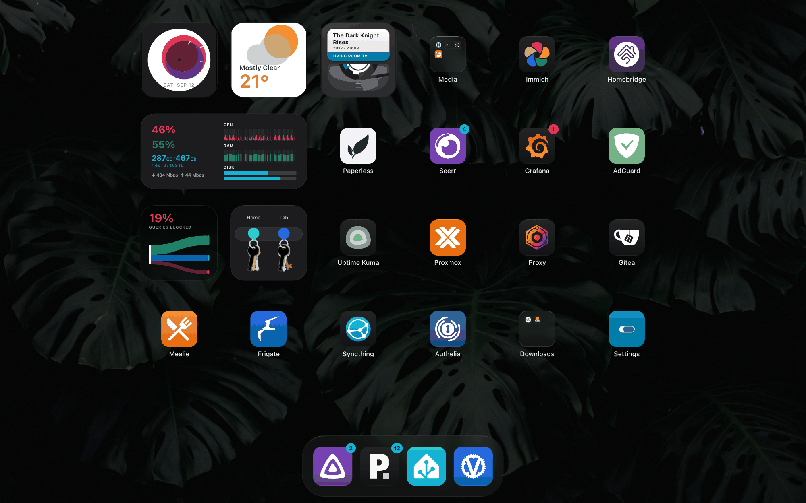

<h1 align="center">Stackyard</h1>

<p align="center"><b>A self-hosted homelab dashboard you actually want to look at.</b></p>

<p align="center">
  <a href="https://github.com/SandObserver/stackyard/pkgs/container/stackyard"></a>
  <a href="https://hub.docker.com/r/sandobserver/stackyard"></a>
  <a href="https://github.com/SandObserver/stackyard/releases"></a>
  <a href="https://github.com/SandObserver/stackyard/actions/workflows/test.yml"></a>
</p>

<p align="center"></p>


<p align="center">Try it: <b><a href="https://stackyard-demo.onrender.com">stackyard-demo.onrender.com</a></b><br>
<sub><i>Note: The first demo visit may take up to a minute due to Render's free-tier cold start.</i></sub>

Most dashboards are a wall of numbers and charts. Stackyard is the opposite: a calm, launcher-style grid of app tiles, folders, and a small number of
*genuinely useful* widgets, running in a single container. Built to be glanced at a hundred times a day without feeling cluttered.

## Contents

- [Why Stackyard](#why-stackyard)
- [Widgets](#widgets)
- [Live activity badges](#live-activity-badges)
- [Icons](#icons)
- [Getting started](#getting-started)
- [Security](#security)
- [Building from source](#building-from-source)
- [Contributing](#contributing)
- [Changelog](#changelog)
- [License](#license)

## Why Stackyard

- **Attention goes where it's needed, not everywhere at once.** A calm grid, no charts or counters. Health badges only appear when something's wrong.
- **A glance should tell you more than a number would.** Widgets are small visuals, not readouts.
- **Anything can be a badge.** Point Stackyard at any API, pick a value from the response, and show it as a [live activity badge](#live-activity-badges). No custom widget, no code.
- **Configured by clicking, not by editing files.** Everything is set up in the web UI, with config import and export.
- **No dependencies.** Review it once and stop worrying about the supply chain.
- **Six languages, right-to-left included.** Contrast and screen-reader labels are covered by tests.
- **Installs like an app.** A mobile layout that opens in its own window from a home screen. No offline mode: every tile is live.

## Widgets

Widgets and the services they read:

- **Clock**
- **Now Playing**: Plex, Jellyfin, Emby, Navidrome
- **Weather**: Open-Meteo (no API key required)
- **DNS**: AdGuard, Pi-hole, Technitium, NextDNS
- **GitHub**: contribution graph and pull requests
- **Books**: Audiobookshelf, Komga, Kavita
- **System summary**: CPU, memory, disk, throughput, uptime, and network speed from SpeedTest Tracker or MySpeed. Reports on this machine or on a host running Glances
- **Disk health**: TrueNAS, Scrutiny
- **Backup**: Duplicati, Kopia
- **Connections**: Gluetun, Psiphon Conduit, Netbird, Plausible, Umami

A Glances running in Docker reports its own filesystems, not the host's. Mount
the host paths into the Glances container for a disk slot to read them.

Adding one is a folder plus one registry entry, with no changes to the rest of the app. See [docs/widgets.md](docs/widgets.md).

## Live activity badges

Give Stackyard an API endpoint and it lists the numbers in the response, so you pick the one you want on the tile. Point it at Sonarr's queue and the Sonarr tile carries a count of episodes still downloading. **Show From** sets a floor, so a queue that is never quite empty stays quiet until it matters.

## Icons

App icons resolve automatically by name from the community [dashboard-icons](https://github.com/homarr-labs/dashboard-icons) set. You can also upload your own; custom icons are stored in `./icons`.

## Getting started

You need [Docker](https://docs.docker.com/get-started/get-docker/).

**Using Docker Compose:**

```yaml
services:
  stackyard:
    image: ghcr.io/sandobserver/stackyard:latest
    container_name: stackyard
    restart: unless-stopped
    ports:
      - "8700:80"
    volumes:
      - ./data:/data
      - ./icons:/icons
```

```sh
docker compose up -d
```

**Or with `docker run`:**

```sh
docker run -d \
  --name stackyard \
  --restart unless-stopped \
  -p 8700:80 \
  -v ./data:/data \
  -v ./icons:/icons \
  ghcr.io/sandobserver/stackyard:latest
```

**On Unraid:** install it from [Community Apps](https://ca.unraid.net/apps/stackyard-0ara4ku0sjjwqy).

Then open `http://localhost:8700` and set everything up at `/admin`. Config and uploaded icons persist in `./data` and `./icons`.

The same image is on Docker Hub as `sandobserver/stackyard`. Prefer `ghcr.io`: it is the registry the [release signature](docs/security.md#verifying-a-release-image) covers.

The repo's [`docker-compose.yml`](docker-compose.yml) is the recommended version: it adds resource limits, dropped capabilities, and commented options for a reverse proxy, host access, and Docker health checks.

Every section of the admin UI is shown in [docs/screenshots.md](docs/screenshots.md).

## Security

Stackyard never returns stored secrets to the browser, guards the URLs you test in the admin UI against SSRF and pins the resolved IP, and bounds every upstream call so one slow service cannot hang the dashboard. Some features trade safety for convenience and are opt-in with warnings. Read [docs/security.md](docs/security.md) before exposing Stackyard beyond your LAN.

## Building from source

```sh
git clone https://github.com/SandObserver/stackyard.git
cd stackyard
docker build -t stackyard:local .
```

Then run `stackyard:local` the same way as above. For working on the code without Docker, see [CONTRIBUTING.md](CONTRIBUTING.md).

## Contributing

Contributions are welcome, within the constraints that keep Stackyard small and auditable (one container, no backend dependencies, vanilla frontend). See [CONTRIBUTING.md](CONTRIBUTING.md) and [docs/frontend.md](docs/frontend.md). Participation is covered by the [Code of Conduct](CODE_OF_CONDUCT.md).

## Changelog

Notable changes are listed in [CHANGELOG.md](CHANGELOG.md); per-release notes are on the [GitHub Releases](https://github.com/SandObserver/stackyard/releases) page.

## License

Licensed under the [Apache License 2.0](LICENSE). You are free to use, modify, fork, and build on Stackyard, including commercially. In return you must keep the existing copyright and attribution notices, and the license does not grant rights to the **Stackyard** name or logo: forks are welcome but must use their own name and not present themselves as the original project. See [NOTICE](NOTICE).
