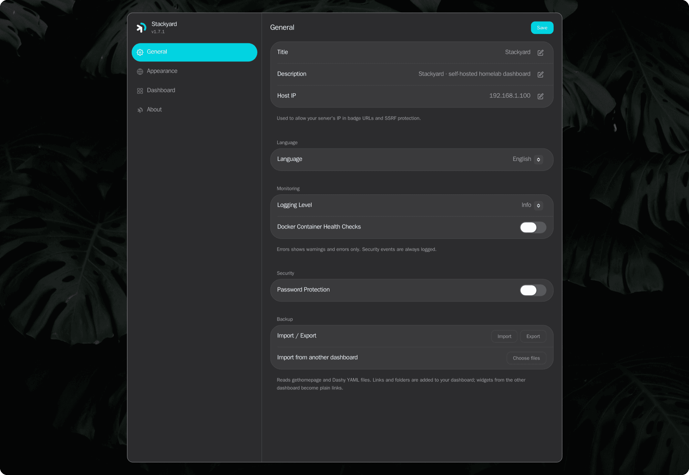
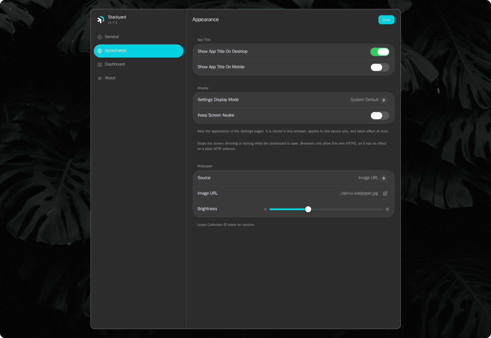
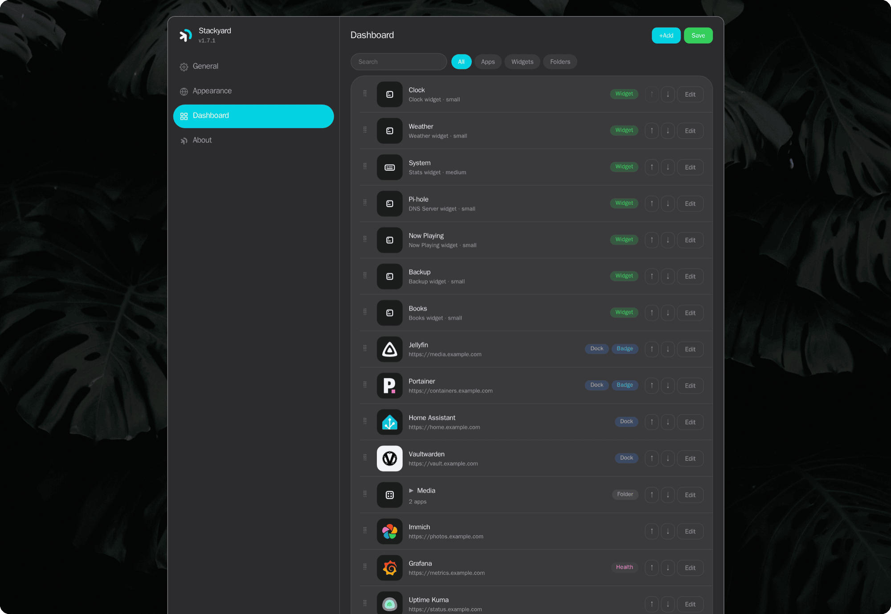
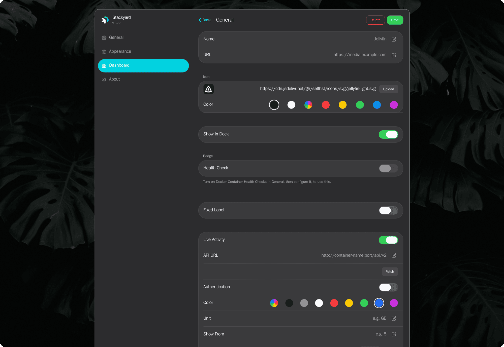

# Screenshots

The dashboard, and each section of the admin UI at `/admin`.

## Dashboard

## General

Title, language, password protection, and config import and export. Import also
reads a gethomepage or Dashy YAML file.

## Appearance

Wallpaper, and how the settings pages themselves are displayed.

## Dashboard

Apps, folders, and widgets, in the order they appear on the home screen.

## Editing an app

Icon, colour, dock placement, and the badge the tile carries.

